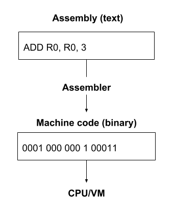
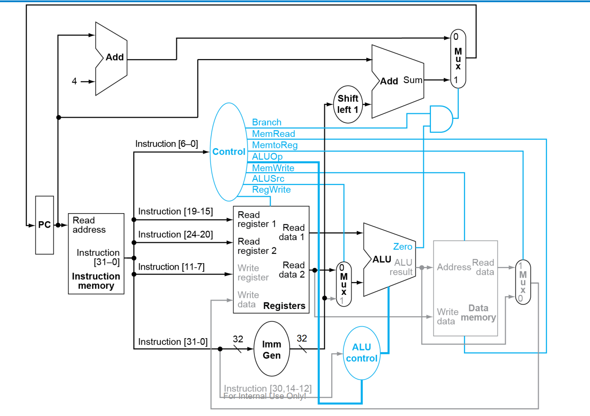

# Implementing Virtual Machine Using C/C++ Language

This is a virtual machine written in C, supporting the RISC-V instruction set.



## How does a VM works?
A VM creates one standard CPU architecture which is simulated on various hardware devices. One advantage of a compiler is that it has no runtime overhead while a VM does. Even though compilers do a pretty good job, writing a new one that targets multiple platforms is very difficult, so VMs are still helpful here. 
In practice, VMs and compilers are mixed at various levels.

A VM is a program that acts like a computer. It simulates a CPU along with a few other hardware components, allowing it to perform arithmetic, read and write to memory, and interact with I/O devices, just like a physical computer. Most importantly, it can understand a machine language which you can use to program it.

## Features

- **Instruction Set**: Supports RISC-V
- **Build Tool**: Compiled using Makefile


## Installation

Make sure you have [Make](https://www.gnu.org/software/make/) and the necessary compilers installed.

```bash
git clone https://your-repo-url.git
cd your-repo-directory
make

````
## Usage

After compilation, you can run the virtual machine with the following command:

```bash
./your-vm-executable
```

```asm
Address     Code        Basic                        Line Source

0x00400000  0x00400893  addi x17,x0,4                11       li a7, 4                # syscall for print_string
0x00400004  0x0fc10517  auipc x10,0x0000fc10         12       la a0, prompt1         # load address of prompt1
0x00400008  0xffc50513  addi x10,x10,0xfffffffc           
0x0040000c  0x00000073  ecall                        13       ecall
0x00400010  0x00500893  addi x17,x0,5                15       li a7, 5                # syscall for read_int
0x00400014  0x00000073  ecall                        16       ecall
0x00400018  0x00a002b3  add x5,x0,x10                17       mv t0, a0               # store first number in t0
0x0040001c  0x00400893  addi x17,x0,4                20       li a7, 4                # syscall for print_string
0x00400020  0x0fc10517  auipc x10,0x0000fc10         21       la a0, prompt2         # load address of prompt2
0x00400024  0xfe050513  addi x10,x10,0xffffffe0           
0x00400028  0x00000073  ecall                        22       ecall
0x0040002c  0x00500893  addi x17,x0,5                24       li a7, 5                # syscall for read_int
0x00400030  0x00000073  ecall                        25       ecall
0x00400034  0x00a00333  add x6,x0,x10                26       mv t1, a0               # store second number in t1
0x00400038  0x006283b3  add x7,x5,x6                 29       add t2, t0, t1          # t2 = t0 + t1
0x0040003c  0x00400893  addi x17,x0,4                32       li a7, 4                # syscall for print_string
0x00400040  0x0fc10517  auipc x10,0x0000fc10         33       la a0, result           # load address of result
0x00400044  0xfc050513  addi x10,x10,0xffffffc0           
0x00400048  0x00000073  ecall                        34       ecall
0x0040004c  0x00700533  add x10,x0,x7                36       mv a0, t2               # move the sum to a0 for printing
0x00400050  0x00100893  addi x17,x0,1                37       li a7, 1                # syscall for print_int
0x00400054  0x00000073  ecall                        38       ecall
0x00400058  0x00a00893  addi x17,x0,10               41       li a7, 10               # syscall for exit
0x0040005c  0x00000073  ecall                        42       ecall
```

## Contributing

Contributions of any kind are welcome! Please feel free to submit issues or pull requests.

## License

This project is licensed under the MIT License. See the LICENSE file for more details.
```

Feel free to modify any part of it to better fit your project!